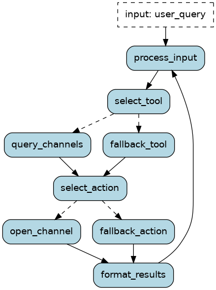

# BOTVOV

An AI assistant that supports answering questions and performing tasks from users, with speech-to-text and text-to-speech capabilities.

## Features

- Speech-to-Text - Implement repo [Fast-whisper-server](https://github.com/fedirz/faster-whisper-server) - use *PhoWhisper* large model


    Converts the [vinai/PhoWhisper-large](https://github.com/VinAIResearch/PhoWhisper) model (a pretrained ASR model by VINAI) from the Hugging Face transformers format into the CTranslate2 format for optimized inference.

- Text-to-Speech - Implement repo [vietTTS](https://github.com/NTT123/vietTTS)
- LLM-based Agent - Use Qwen2.5:3b self-host by [vLLM](https://github.com/vllm-project/vllm) serving
- RESTful API interface - FastAPI
- [Burr](https://github.com/DAGWorks-Inc/burr) - Monitor, trace, persist, and execute on my own agent infrastructure.

## Prerequisites

- Python 3.10 or higher
- poetry
- Docker
- Burr Framwork
- instructor
- vLLM

## Deployment

```bash
sudo make run # Run docker-compose -> start all container
sudo make stop # Stop all container
```

## Configuration
The project can be configured through:

* llm.yaml - LLM settings
* models.yaml - Model configurations
* params.yaml - General paramters
* text2speech - TTS settings


## API Endpoints

### Create New Application
- **Endpoint:** `/botvov/create_new`
- **Method:** `GET`
- **Description:** Registers a new user and creates a new application instance.
- **Response:**
  - `status_code`: HTTP status code
  - `uid`: Unique identifier for the new application
  - `message`: Response message
  - `status`: Operation status

### Send Audio Query
- **Endpoint:** `/botvov/send_audio_query`
- **Method:** `POST`
- **Description:** Processes an audio query and returns the corresponding command.
- **Parameters:**
  - `uid`: Unique identifier for the application
  - `lat`: Latitude of the user's location
  - `long`: Longitude of the user's location
  - `audio`: Audio file to be processed
- **Response:**
  - `audio/wav`: Processed audio response

### Get Command Response
- **Endpoint:** `/botvov/get_audio_response`
- **Method:** `GET`
- **Description:** Retrieves the command response for a given application.
- **Parameters:**
  - `uid`: Unique identifier for the application
- **Response:**
  - `status_code`: HTTP status code
  - `text_response`: Textual response from the application
  - `data`: Command response data
  - `message`: Response message
  - `status`: Operation status


## Multi-Agent Workflow



## Project Structure

```
BOTVOV/
├── botvov/                 # Main service: Qwen2.5:3b LLM 
│   ├── main.py             # Define API endpoint
│   ├── llm_service.py      # Use Burr framework to build multi-agent workflow
│   ├── stt_service.py      # Call speech2tech service
│   ├── tts_service.py      # Call text2speech service
│   ├── run_burr_UI.sh      # Bash script to run: Burr tracking, run main
│   ├── models.py           # Define some models (Pydantic)
│   ├── utils.py
│   └── tool_calling/
│       ├── VOV_channel.py  # Define class to provide vov channel information from API
│       └── Weather.py      # Define class to provide weather from OpenWeather API
├── speech2text             
├── text2speech             
├── docs/                   # API docs
├── .gitignore
├──             
├── requirements.txt        # Danh sách các thư viện cần thiết
├── Dockerfile              # Dockerfile để đóng gói ứng dụng
└── README.md               # Tệp hướng dẫn sử dụng dự án
```

